# HIPI Board — User Manual

**HP-IL Pico Interface for the HP-41**

<!-- TODO image: replace the placeholder below with:
 -->
> 📷 **Image placeholder:** HIPI and an HP-41 connected and running (`images/hero-hipi-with-hp41.jpg`)

---

## Contents

1. [What is HIPI?](#1-what-is-hipi)
2. [What you need](#2-what-you-need)
3. [Getting started](#3-getting-started)
4. [Using the touch screen](#4-using-the-touch-screen)
5. [The three views](#5-the-three-views)
6. [The menus](#6-the-menus)
7. [Cassette files](#7-cassette-files)
8. [HIPI's other devices](#8-hipis-other-devices)
9. [Connecting to a PC](#9-connecting-to-a-pc)
10. [Screen dumps](#10-screen-dumps)
11. [The HP-IL analyzer](#11-the-hp-il-analyzer)
12. [The settings file, CONFIG.TXT](#12-the-settings-file-configtxt)
13. [Updating the software](#13-updating-the-software)
14. [Troubleshooting](#14-troubleshooting)
15. [Words you may meet](#15-words-you-may-meet)

---

## 1. What is HIPI?

HIPI is a small box with a touch screen that connects to your HP-41, HP-71 or HP-75 through the
HP-IL module. To the device it looks like a whole set of classic HP peripherals
at once:

| HIPI acts as…                 | Original HP device        | Shows up as |
|-------------------------------|---------------------------|-------------|
| Video display                 | HP 82163 Video Interface  | `TFDISPLAY` |
| Cassette drive                | HP 82161A Digital Cassette Drive | `TFDRIVE` |
| Plotter                       | HP 7470A                  | `TFPLOT`    |
| Temperature/pressure sensor   | —                         | `TFTEMP`    |
| LEDs and colour pixels        | —                         | `TFLEDS`, `TFPIXEL` |
| Link to a PC (e.g. pyIlPer)   | PILBox                    | `PILBOX`    |
| Terminal over USB             | —                         | `TFTERM`    |

Cassettes are simply files on a micro-SD card, so you never run out of tape.

<!-- TODO image: replace the placeholder below with:
 -->
> 📷 **Image placeholder:** The finished HIPI unit, front view (`images/hipi-unit-front.jpg`)

<!-- TODO image: replace the placeholder below with:
 -->
> 📷 **Image placeholder:** The connectors — HP-IL IN/OUT, USB, SD card slot (`images/hipi-unit-connectors.jpg`)

---

## 2. What you need

- An **HP-IL Controller** device
  - E.g. a **HP-41** (C, CV or CX) with an **HP 82160A HP-IL module**
  - Or a **HP-71/75** with **HP-IL**
- The **HIPI unit**
- **HP-IL cables** — two, to make the loop with the HP-41
- A **micro-SD card** (FAT32 recommended)
- A **USB cable** and a USB power supply (or a computer)

---

## 3. Getting started

### 3.1 Prepare the SD card

The HIPI download contains two things: the software (a `.uf2` file, see
[chapter 13](#13-updating-the-software)) and a **zip file with everything the SD
card needs**.

1. Unzip the SD card zip.
2. Copy its contents to the SD card, keeping the folders.
3. Put your own cassettes (`.dat` files) in the `lif` folder — see
   [chapter 7](#7-cassette-files).

The SD card then looks like this:

```
CONFIG.TXT        HIPI's settings (created by HIPI itself)
resources/        the cassette drive's pictures: hp82161a.bmp,
                  tape-in.bmp, open.bmp, leds.bmp, reels.bmp
lif/              your cassettes (.dat files)
screenshots/      screen dumps (created by HIPI when you save the first)
logs/             analyzer logs (created when you start the first)
```

HIPI creates its settings file, `CONFIG.TXT`, by itself. The buttons, menus and start-up screen are built in, so HIPI can be used without an SD card too — just without cassettes, pictures and saved settings.

### 3.2 Connect everything

1. Turn the controller **off**.
2. Connect the controller's HP-IL **OUT** to HIPI's **IN**, and HIPI's **OUT** back
   to the controller's **IN**. HP-IL always forms a closed loop.
3. Insert the SD card (if you have one).
4. Connect USB power. HIPI starts.
5. Turn the controller on.


### 3.3 First start

HIPI shows its start-up screen: the version, and a **STATUS** list that fills
in line by line as HIPI starts — SD card, settings, the HP-IL loop, the
tape pictures, each cassette drive's file, the trace setting, USB and the
PILBox link to a PC program. A green dot means OK, red means something is
missing, grey means off.

The **PILBox** line changes as soon as a PC program (e.g. pyILPER) connects:
`waiting (TDIS)` until then, `connected (COFF)`, `(COFI)` or `(CON)` after
— the mode the program chose — or `disabled` if PILBOX is switched off in
**Devices**.

On the right, the **DEVICES ON THE LOOP** are shown in loop order: yellow
when switched on, grey when off.

After a few seconds (or when you touch the screen) HIPI is ready. Anything
the controller prints now appears on the screen.

<a href="images/screen-startup.png">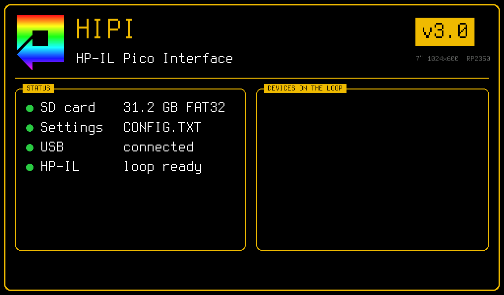</a>

<a href="images/screen-startup-ready.png">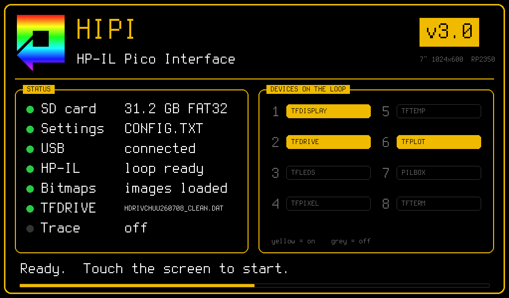</a>

---

## 4. Using the touch screen

### 4.1 The button strip

The buttons are hidden to give the text more room. **Touch the right edge of the
screen** to slide them in. They slide away again after 5 seconds without use.

<a href="images/screen-button-strip.png">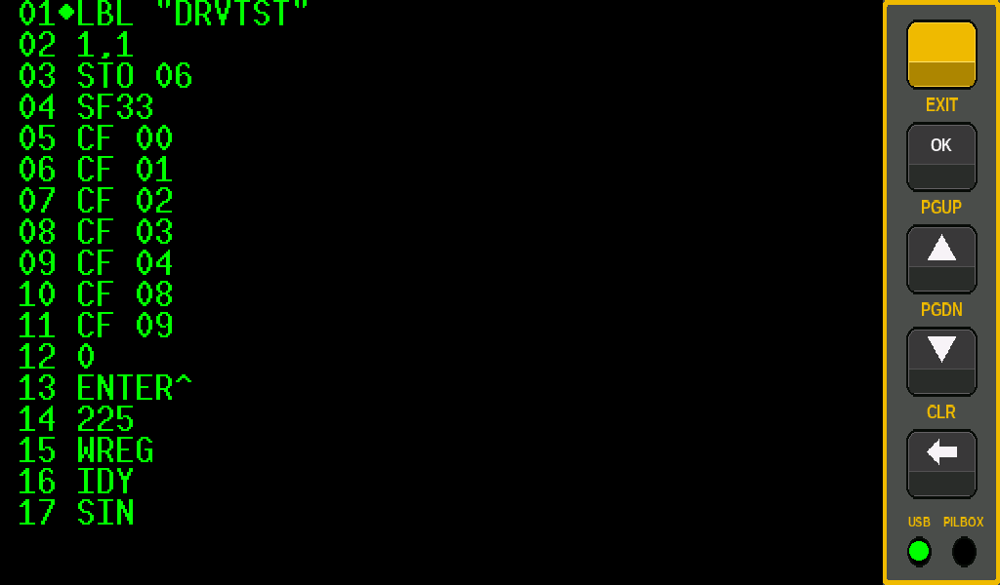</a>

| Button | Does | With **Shift** first |
|--------|------|----------------------|
| **OK** | Opens the menu / chooses | EXIT — closes the menu |
| **▲**  | Scrolls text back one line / moves up | One page |
| **▼**  | Scrolls forward one line / moves down | One page |
| **X**  | Back to the live text / back one menu level | CLR — clears the screen |

**Shift** is the yellow button at the top: tap it, then tap the other button.

### 4.2 Corners and swipes

| Touch | What happens |
|-------|--------------|
| **Top-left corner** | Info box: current file, settings, version |
| **Bottom-left corner** | List of HIPI's HP-IL devices and their addresses. The PILBOX line shows the link to a PC program — `COFF`, `COFI` or `CON` when connected, `TDIS` when not — and the PC's devices with their addresses. Swipe up/down to scroll |
| **Swipe left or right** | Switch view. Each device with a view (display, plotter, cassette drive) has its own, in the order the devices are on the loop: swipe left for the next, right for the previous |

<a href="images/screen-infobox.png">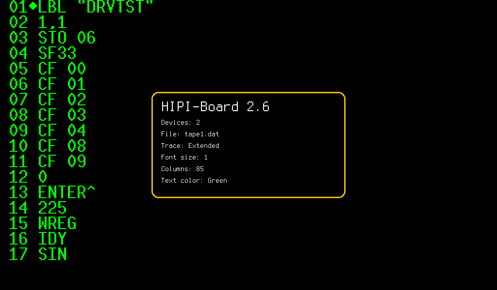</a>

<a href="images/screen-devicelist.png">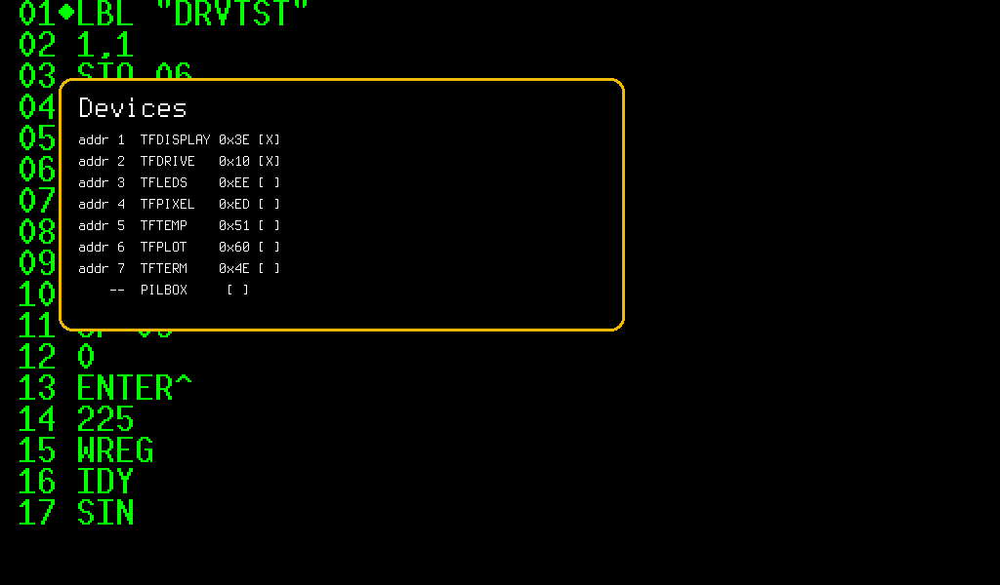</a>

When you switch view, a yellow box shows the name of the new view for a moment.
Touches are ignored while it's showing.

<a href="images/screen-swipe-splash.png">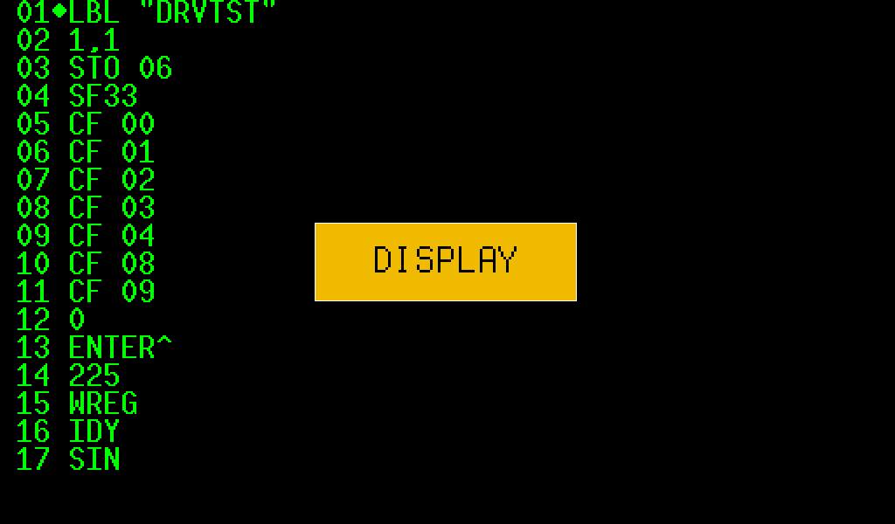</a>

### 4.3 Screen saver and clock

After 10 minutes without anything happening — no new text or drawing on the
screen, no touch — HIPI starts its screen saver. Choose what it does in
**More → Settings → Screen saver**:

| Setting | Choices |
|---------|---------|
| **Mode** | **Dim** (the default) — only the backlight goes down to 10 %; the screen keeps showing what it showed · **Clock** — a big clock fills the screen · **HP-IL rain** — HP-IL messages fall down the screen like in *The Matrix*, taken from the real traffic on the loop when there is any · **Goose** — the HP-41's "running" goose, in flocks of different sizes, flies across the screen · **Random** — HP-IL rain or Goose, picked anew each time the screen saver starts, in a random style (Dark or LCD) · **Off** |
| **No clock** | What Clock mode shows when there's no clock chip or its time isn't set: **HP-IL rain**, **Goose**, **Random** or **Dim** |
| **Style** | **Dark** — light on black · **LCD** — dark on a light background, like an old LCD (clock, rain and geese) |
| **Date** | **EU** — `2026-10-03` · **US** — `10/03/2026` |
| **Time** | **24 h** — `14:05` · **12 h** — `2:05 PM` |
| **Show now** | Starts the screen saver right away (the clock if the mode is Dim or Off), to try the settings |

With the clock, the rain and the goose the backlight also slowly dims to
10 %.

Anything new on the screen ends the screen saver at once and brings back
what was shown before. A touch also ends it; that first touch only wakes
the screen and doesn't press anything.

<a href="images/screen-clock.png">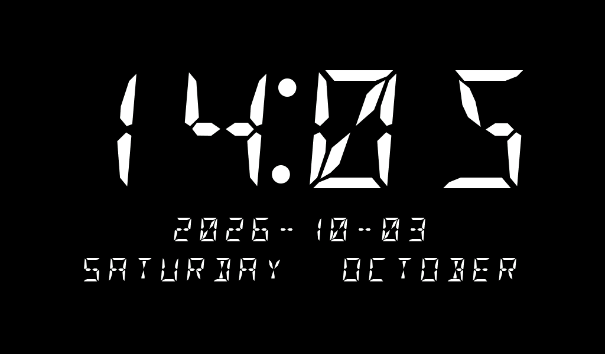</a>

**The clock needs a clock chip** (a DS3231 real-time clock module) connected
to HIPI, with its battery. Without it — or before its time has been set —
the screen saver shows what **No clock** says instead: HP-IL rain, the geese,
either of them at random, or just dimming.

**Setting the time:** connect HIPI to a computer with USB, open the debug
serial port in a terminal program (on Linux usually `/dev/ttyACM0`), type

```
time 2026-10-03 14:05
```

and press Enter (seconds can be added: `14:05:30`). Typing `time` alone shows
the clock's current time. The clock keeps its time on its battery, also
when HIPI is switched off.

**HP-IL rain.** A nod to *The Matrix*: instead of green code, HP-IL messages
rain down the screen — `RFC`, `TAD 01`, `SDA`, `DAB 41` — each column at its
own speed, with a bright head and a fading trail. Whenever there is traffic
on the loop, the rain is made of the real frames HIPI sees passing by; when
the loop is quiet, it makes them up.

<a href="images/saver_rain.png">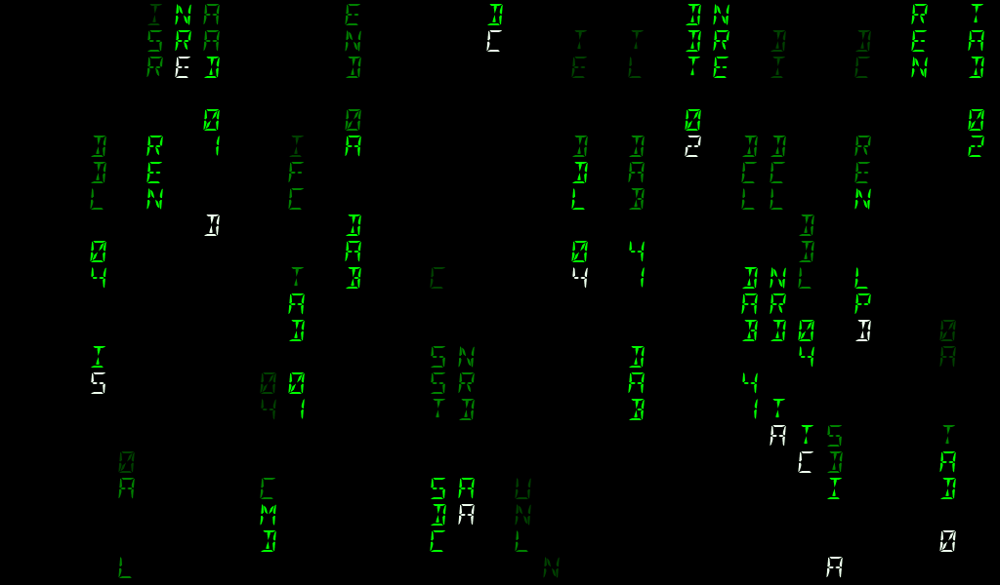</a>

**Goose.** Every HP-41 owner knows the little goose that flies across the
display while a program runs. Here it has left the calculator: flocks of
geese, big and small, fly across the screen from left to right, each at its
own speed — the program is still running somewhere.

<a href="images/saver_goose.png"></a>

---

## 5. The three views

### 5.1 Display

The HP 82163 video display: everything the controller prints, like `PRA`, `PRX` or
program listings. Scroll back with ▲ and ▼.

<a href="images/view-display.png"></a>

### 5.2 Plotter

Shows what the controller draws on the plotter (`TFPLOT`). The drawing keeps growing
while you look at other views. Clear it with **Clear plotter** in its menu (OK).

**Plot view** in its menu (OK) — or **Settings → Screen** — chooses how the drawing is placed on the screen:

- **Fit** (the default) — the drawing itself, with a small margin, as large
  as the screen allows and centred. It grows along as more is drawn.
- **Page** — the plotter's whole drawing area, like the paper. The
  plots don't sit in the middle of it (e.g. the plotter module leaves room for
  the axis labels), so they look shifted up and to the right.

Both keep the proportions: circles stay round and text undistorted.

**Paper** in the same menus chooses the paper colour:

- **White** (the default) — like real plotter paper: dark pens on white.
  Pen 1 is black, then red, blue, green and dark yellow.
- **Black** — inverted: light pens on black, easier on the eyes in a dark
  room. Pen 1 becomes white, and the other pens get brighter tones
  that show up well on black.

The drawing is redrawn at once in the new colours; nothing is lost.

<a href="images/view-plotter.png"></a>

### 5.3 Tape

A picture of the HP 82161A cassette drive — and you can use it like the real
thing.

<a href="images/view-tape.png">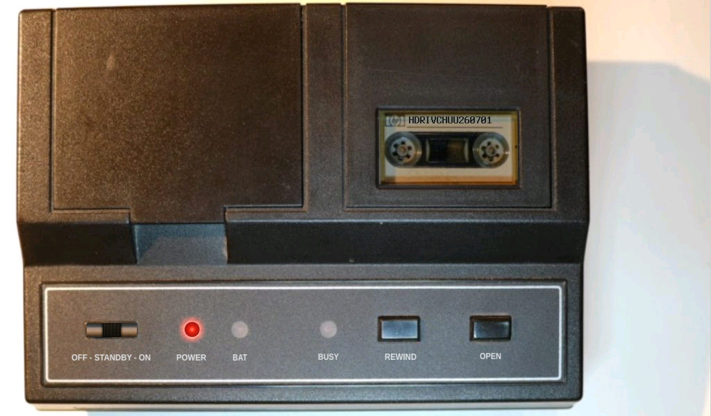</a>

| On the picture | What it does |
|----------------|--------------|
| **Cassette window** | Shows the cassette with the file name on its label. Touch it to pick another file |
| **OPEN** button | Opens the lid and the file list |
| **REWIND** button | Rewinds the tape (takes a few seconds; not while BUSY is lit) |
| **OFF–STANDBY–ON** switch | Touch to move it one step. OFF takes the drive off the loop; ON keeps it on; in STANDBY the controller can switch it off and on to save power |
| **POWER** light | The drive is on |
| **BUSY** light | The drive is working, or the controller is talking to it |
| **Reels** | Spin while the tape is read, written or wound |

<a href="images/view-tape-open.png">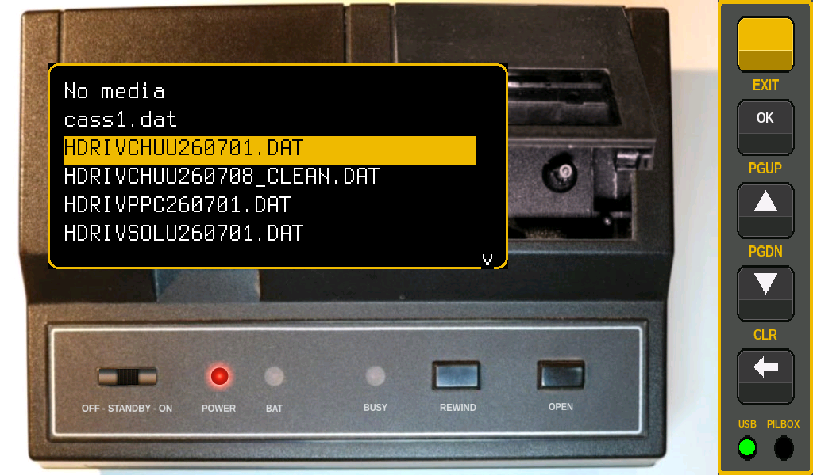</a>

### 5.4 Choosing the view from the HP-41

A program can choose which view the screen shows, just like a swipe or
**Go to view** would. Send the escape sequence `ESC # V` followed by the
**HP-IL address** of the device whose view you want, with the display
device selected:

| Keys | Shows |
|------|-------|
| `27 ACCHR  35 ACCHR  86 ACCHR  3 ACCHR` | The view of the device at address 3 |

The last byte is the address itself (1–30) as a character code, not as
digits — `3 ACCHR`, not `51 ACCHR`. You find the addresses in the device list
(bottom-left corner), or with `FINDID` (Extended I/O module) in the program.

It follows what is actually on the loop: whichever HIPI device has that
address gets its view shown — today the display, the plotter and the
cassette drive(s). If the address belongs to a device without a view
(e.g. `TFLEDS`), to a device that's switched off, to a device that isn't
part of HIPI, or to no device at all, **nothing happens** — no error, just a
warning in the log.

The yellow name box appears as usual. If a menu is open, the switch waits
until it's closed. A screen saver ends, and the chosen view is shown.

---

## 6. The menus

Press **OK** to open the menu. **▲/▼** to move, **OK** to choose, **X** to go
back. **Shift + OK** closes the menu from anywhere.

**The menu belongs to what you're looking at.** OK first opens the menu of
the view on the screen — the things you'd want to do right there, like
clearing the plotter in the Plotter view. Its last row, **More**, leads to
HIPI's own menu: going to another view, the settings, and the system
functions. The menu's name is always shown in the band at the top of its
frame, e.g. *PLOTTER* or *SETTINGS / SCREEN*.

Three kinds of rows:

- **Settings >** — a row ending in **>** opens another menu or dialog.
- **Clear plotter** — a row without one does it at once.
- **Plot view  < Fit >** — a setting, with its value at the right: **OK**
  changes it to the next value, at once and remembered.

Every menu has the same order: where to go, what to do, settings, then
**More**.

<a href="images/menu-display.png">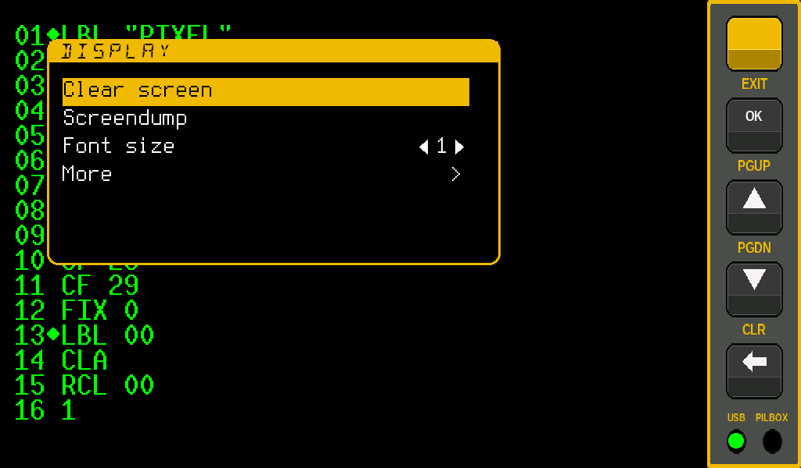</a>

```
OK in a view — that view's menu
├── DISPLAY          Clear screen · Screendump · Font size < 0 > · More >
├── PLOTTER          Clear plotter · Screendump · Plot view < Fit > ·
│                    Paper < White > · More >
├── TAPE TFDRIVE     Select cassette > · Rewind · Power < ON > · Screendump · More >
├── ANALYZER         Leave view · Clear · Logging > · Mode < Overview > ·
│                    Time < Relative > · Idle frames < Hidden > · More >
├── LOOP MAP         Leave view · Screendump · More >
└── HP-IL SIGNALS    Leave view · Screendump · Bit cells < Bands > · More >

More > — HIPI's menu
├── Go to view >     Display · Plotter · Tape (one row per device) ·
│                    Analyzer · Loop map · HP-IL signals
├── Settings >
│   ├── Screen >         Text colour < White > · Font size < 0 > · Columns < Auto > ·
│   │                    Brightness < 100% > · Plot view < Fit > · Paper < White > ·
│   │                    Mirror to PC < Off >  (7" only)
│   ├── Screen saver >   Mode < Dim > · No clock < HP-IL rain > · Style < Dark > ·
│   │                    Date < EU > · Time < 24 h > · Show now
│   ├── Devices >        Enable/disable > · Change order > · Drive at start < ON >
│   └── PC link >        CON loop < Cable > · Trace < Off >
└── System >
    ├── Connect to PC    Show the SD card on your computer
    ├── Loopback test >  Test the HP-IL connection
    ├── Scan I2C >       List connected I2C sensors
    ├── Character table > The HP-41's character codes 0-127
    ├── About >          Version and hardware
    └── Bootsel mode     Get ready for a software update
```

(Screendump is on the 7" panel only.) All settings are remembered, also
after power off.

### A few worth knowing

- **Settings → Devices → Enable/disable** — each of HIPI's devices can be switched off. A switched-off device
  is gone from the loop, just as if it were unplugged. Handy if you have the
  real HP device connected too.
- **System → Character table** — a help page: the HP-41's character codes
  0–127 (decimal), each with the character as the HP-41's display shows it,
  over the whole screen. (Codes the HP-41 can't show appear with all
  segments on; for 102–125 the lower-case letters and `{|}` are shown
  instead.) Handy with `XTOA`/`ATOX` or when sending text to HIPI's devices.
  Touch the screen (or any button) to close it.
- **Settings → Devices → Drive at start** — where the cassette drive's power
  switch is when HIPI starts: **ON**, **STANDBY** or **OFF** (switched off,
  like in *Enable/disable* — not on the loop). To switch the drive right now,
  use **Power** in the Tape view's menu, or the switch on the picture.
- **Settings → Devices → Change order** — sets the order of HIPI's devices on the loop,
  which also decides their addresses. Pick a device with ▲/▼ and **OK**, move
  it with ▲/▼, and press **OK** to keep the new place (or **X** to put it back).
  The order is remembered; the controller hands out the new addresses the next time
  it sets up the loop.
- **Columns** — *Auto* fits the font size; *32* is the original HP 82163 width.
- **System → Loopback test** — connect HIPI's IN and OUT with itself (no controller),
  then run it. "Loopback OK!" means the HP-IL side works.

<a href="images/menu-devices.png">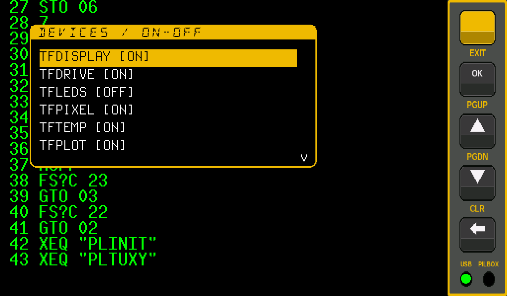</a>

<a href="images/menu-loopback.png">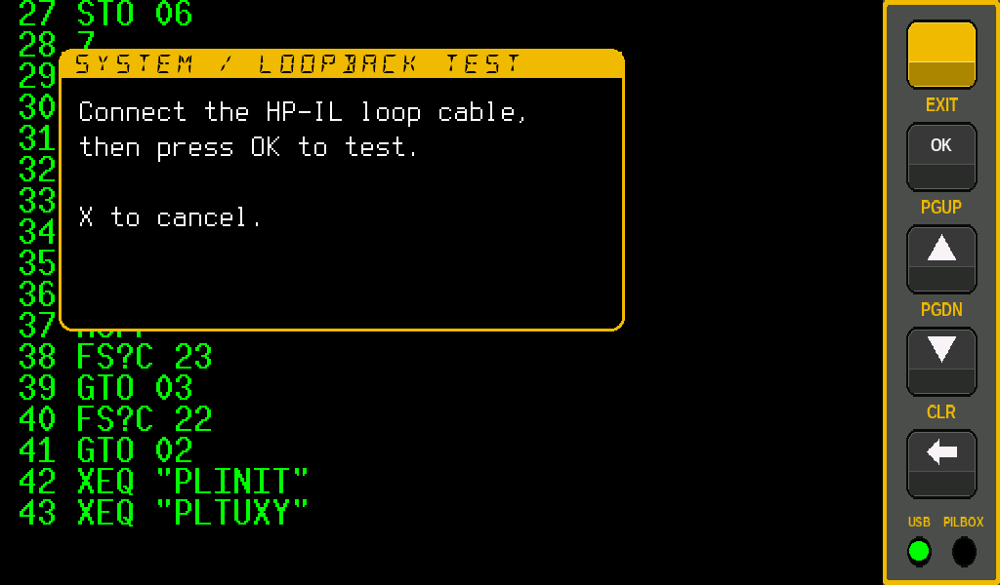</a>

---

## 7. Cassette files

Each `.dat` file on the SD card is one cassette.

### Adding cassettes

Copy your `.dat` files to the `lif` folder on the SD card — either with a
card reader, or straight from HIPI with **Connect to PC** (see
[chapter 9](#9-connecting-to-a-pc)).

### Choosing a cassette

Use **Select cassette** in the Tape view's menu (OK), or touch the cassette window in the Tape view.

<a href="images/menu-filelist.png">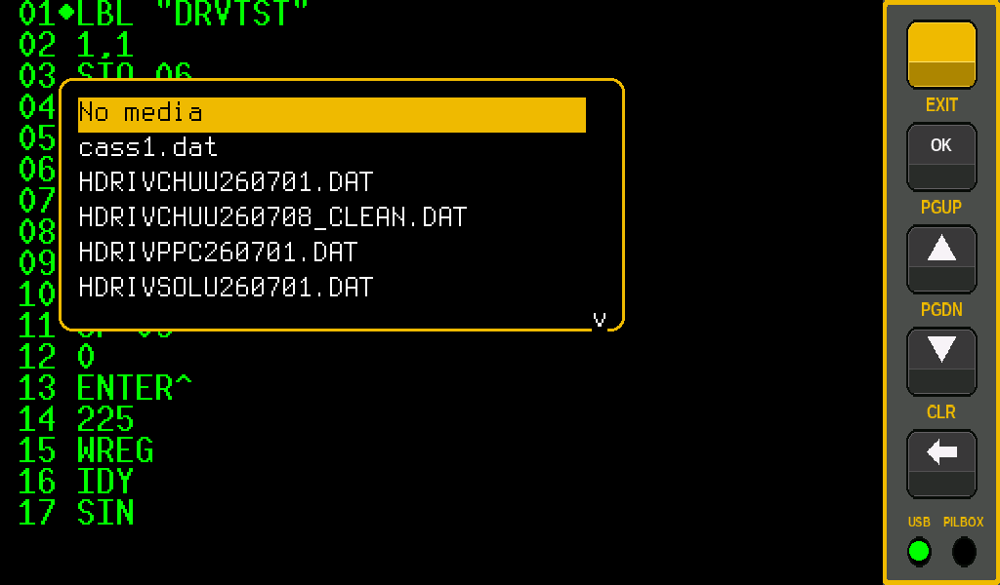</a>

- **No media** at the top means *no cassette in the drive*.
- After choosing a file you get three options:
  **OK** — use it, **X** — back to the list, **▼** — show what's on it.
- While the file list is open the drive has no cassette in it, just like a real
  drive with the lid open.

### What's on the cassette?

Press **▼** to see the cassette's contents: its name, size, free space and the
list of files with type and size (in registers, like the HP-41's `DIR`).
Scroll with ▲/▼ (Shift for a page), **OK** to use the cassette, **X** to go back.

<a href="images/menu-lif-contents.png">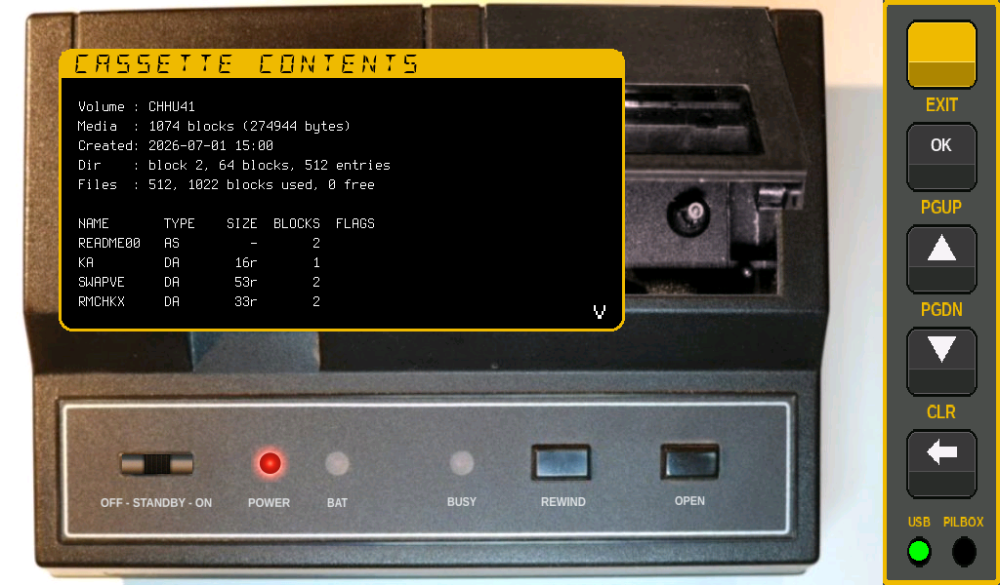</a>

---

## 8. HIPI's other devices

Besides the display and the cassette drive, HIPI has a few more devices you can
use from your controllers programs. You talk to them like any HP-IL device: **select** it
with its address, then send text with `OUTA` or read with `INA`.

**Finding the address:** touch the **bottom-left corner** of the screen. The list
shows each device's address — use that number with `SELECT`. The examples below
use the address 3; replace it with the one shown on your screen.

### 8.1 Plotter — `TFPLOT`

An HP 7470A pen plotter; the drawing appears in the Plotter view. It works e.g. with the
HP-41 plotter software, and you can also send plotter commands (HP-GL) yourself:

```
01 LBL "BOX"
02 3
03 SELECT
04 "IN SP1"
05 "⊢ PU1000 1000"
06 OUTA
07 "PD4000 1000"
08 "⊢ 4000 4000"
09 OUTA
10 "PD1000 4000"
11 "⊢ 1000 1000"
12 OUTA
13 "PU"
14 OUTA
15 END
```

This draws a square. Swipe to the Plotter view to see it.

Two things make plotter commands easy to type on the HP-41:

- **No `;` needed.** A new command letter, or the end of the text, ends a
  command, and numbers can be separated with spaces instead of commas —
  `PD4000 1000` means the same as `PD4000,1000;`.
- **Long commands are split** over two program lines, since one text line holds
  at most 15 characters. `⊢` is **APPEND** (in ALPHA mode: shift + K), which
  adds the text to what's already in ALPHA.

The following is the result from the example on page 13 in the Plotter Module (82184A) manual.

<a href="images/example-plotter-box.png"></a>

### 8.2 Temperature and pressure — `TFTEMP`

Reads a temperature/pressure sensor connected to HIPI. Tell it what to measure,
then read the value:

| Send | Means |
|------|-------|
| `MT` | Measure temperature (°C) |
| `MP` | Measure pressure (hPa) |
| `P1` | Show 1 decimal (`P0`–`P9`) |

```
01 LBL "TEMP"
02 3
03 SELECT
04 "MT"
05 OUTA
06 INA
07 AVIEW
08 END
```

Each `INA` takes a fresh reading, for example `21.4`.

### 8.3 LEDs — `TFLEDS`

Controls the LEDs on the HIPI board. A command is the LED number(s) followed by
what to do; several commands can be separated by spaces.

| Send | Means |
|------|-------|
| `1O` | LED 1 on (`0` = all LEDs, `135` = LEDs 1, 3 and 5) |
| `1C` | LED 1 off |
| `2B5` | LED 2 blinks 5 times (`B` alone = forever) |
| `3B10:100:400` | LED 3 blinks 10 times, 100 ms on, 400 ms off |
| `0S50` | Brightness 50 % |
| `2F+800` | LED 2 fades on over 0.8 s (`F-` fades off) |

```
01 LBL "BLINK"
02 3
03 SELECT
04 "1B0:100:900"
05 OUTA
06 END
```

LED 1 now flashes briefly once a second, until you send `1C`.

<!-- TODO image: replace the placeholder below with:
 -->
> 📷 **Image placeholder:** HIPI with its LEDs lit (`images/example-leds.jpg`)

### 8.4 Colour pixels — `TFPIXEL`

Controls a strip of colour LEDs (NeoPixels) connected to HIPI. Pixels are chosen
like the LEDs: a number (`1` is the first pixel), `0` for all, or a range like `3-10`.

| Send | Means |
|------|-------|
| `0O` | All pixels on |
| `0C` | All pixels off |
| `0S30` | Brightness 30 % for the whole strip |
| `5X` + one colour byte | Pixel 5 gets a colour |

The colour byte is built as *red* (0–7) × 32 + *green* (0–7) × 4 + *blue* (0–3),
and added to the text with `XTOA` (HP-41CX, or the X-Functions module).
Full red is 7 × 32 = 224:

```
01 LBL "RED"
02 3
03 SELECT
04 "0X"
05 224
06 XTOA
07 OUTA
08 END
```

A few colours: red 224, green 28, blue 3, yellow 252, white 255.

<a href="images/example-pixels.jpg">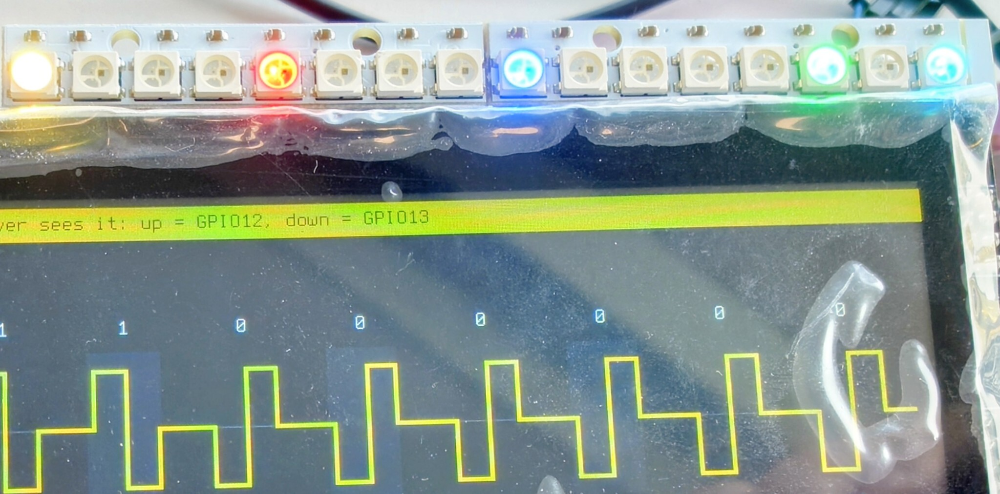</a>

### 8.5 Terminal — `TFTERM`

Makes a terminal program on your computer act as a display and keyboard on the
HP-IL loop — made for the HP-71B's `DISPLAY IS` and `KEYBOARD IS`. From the
HP-41, text sent to `TFTERM` with `OUTA` appears in the terminal program.

HIPI shows up on the computer as a few serial ports; the terminal is the
**third** one (on Linux usually `/dev/ttyACM2`). Open it in any terminal
program, for example PuTTY on Windows or `minicom` on Linux.

<!-- TODO image: replace the placeholder below with:
<a href="images/example-terminal.png"></a> -->
> 📷 **Image placeholder:** A terminal program on the PC showing text from the calculator (`images/example-terminal.png`)

### 8.6 PC link — `PILBOX`

Lets an HP-IL emulator on your computer, such as **pyILPER**, join the loop.
The emulator's virtual drives and printers then work with the controller as if they
were connected with cables. In the emulator, choose the **second** serial port
HIPI creates (on Linux usually `/dev/ttyACM1`) as its PILBox port.

When no emulator is running, `PILBOX` simply passes everything on.

The emulator chooses how PILBox works, and the device list (bottom-left
corner) shows it on the PILBOX line:

| Mode | Means |
|------|-------|
| `TDIS` | No PC program connected — PILBox just passes frames on |
| `COFF` | Connected; the controller is the loop's controller |
| `COFI` | As `COFF`, and idle frames (IDY) are passed to the PC too |
| `CON` | Connected; the PC program is the loop's controller (see below) |

**CON — the PC as controller.** In CON there is no controller on the HP-IL
loop: the PC program controls it, and HIPI starts every frame. HIPI's own
devices are on that loop too: PILBOX's place in the device order
(**Settings → Devices → Change order**) is where the loop begins and ends — the devices
after PILBOX come first, then the cable (HP-IL OUT → other devices → HP-IL
IN), then the devices before PILBOX.

**Settings → PC link → CON loop** chooses the loop:

- **Cable** (the default) — through the HP-IL cable, so a cable (or other
  devices) must go from HIPI's OUT back to its IN.
- **Internal** — closed inside HIPI: the PC reaches HIPI's own devices
  without any cable.

A warning box (touch to close) appears if a frame doesn't come back round
the loop within a second (is the cable connected?), or if frames arrive
that HIPI didn't send — another controller, such as an HP-41, on the loop.
Only one controller may be on a loop.

<!-- TODO image: replace the placeholder below with:
<a href="images/example-pyilper.png"></a> -->
> 📷 **Image placeholder:** pyILPER connected to HIPI's PILBox port (`images/example-pyilper.png`)

---

## 9. Connecting to a PC

To copy cassette files or screen dumps, you can reach the SD card from your
computer without taking it out:

1. Connect HIPI to the computer with USB.
2. Choose **More → System → Connect to PC**. The SD card appears on the computer as a
   USB drive.
3. Copy your files.
4. **Eject** the drive on the computer. HIPI notices and goes back to normal
   by itself. (Or choose **Disconnect from PC** in the menu.)

While connected, the cassette drive is paused and screen dumps are not possible.

<a href="images/pc-usb-drive.png">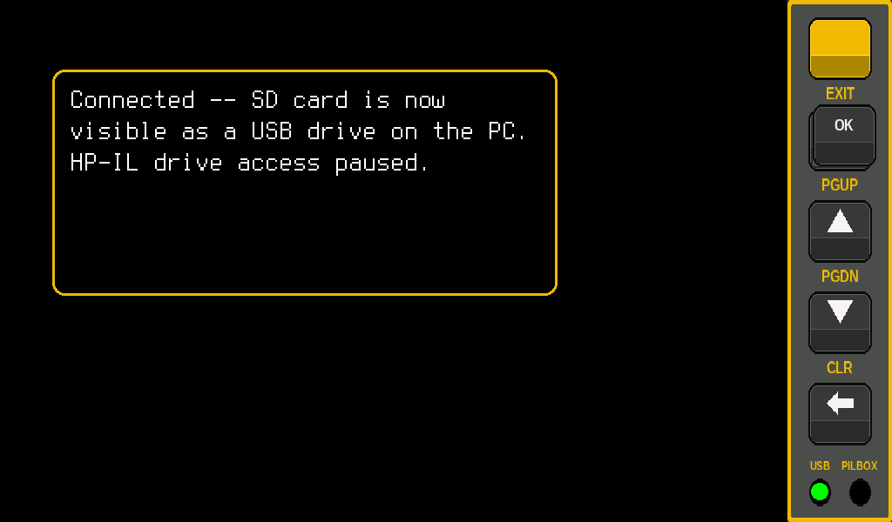</a>

<a href="images/menu-connect-pc.png">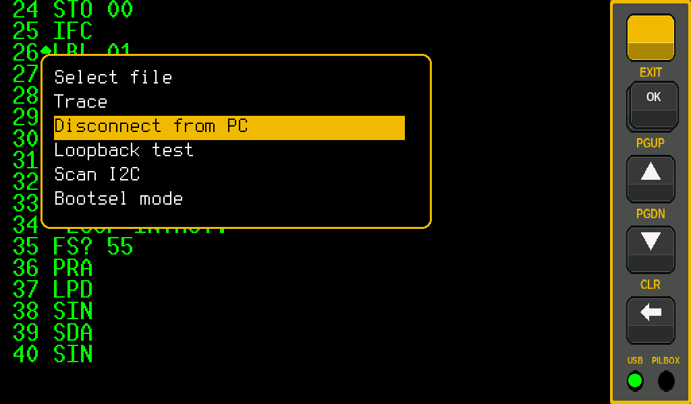</a>

---

## 10. Screen dumps

**Screendump** in a view's menu (OK) saves the screen as a picture in the `screenshots`
folder on the SD card: `screendump_0.bmp`, `screendump_1.bmp` and so on. It takes a few seconds; a
yellow box tells you when it's done. The menu itself is not in the picture.

You can also take one from e.g. a HP-41 program (with the display device selected):

| Keys | Saves |
|------|-------|
| `27 ACCHR  35 ACCHR  68 ACCHR` | Just the screen |
| `27 ACCHR  35 ACCHR  77 ACCHR` | The screen **with** menus and buttons, exactly as you see it |

To choose which view is in the picture first, see
[5.4 Choosing the view from the HP-41](#54-choosing-the-view-from-the-hp-41).

### Recording the screen on a PC (7" panel)

To make a video of HIPI, you don't need a camera. The PC program
**hipiview** (in `tools/hipiview`) shows HIPI's screen in a window,
exactly as on the panel (text, plots, menus, the screen saver, everything),
and records it straight to a video file.

First switch it on in HIPI: **More → Settings → Screen → Mirror to PC
< On >** (it's saved, and off from the start). Then connect HIPI with USB
and start `hipiview`. It finds HIPI's fourth serial
port, **HIPI Display Mirror**, by itself. The first few seconds it reads
what's already on the screen (the title bar shows how far it has come);
after that it follows along live. Press **R** to start and stop recording,
and **S** for a screenshot. HIPI works as usual meanwhile.

HIPI only sends anything while hipiview is running and has asked for the
screen; with hipiview closed, the mirror costs practically nothing. While
it is running, though, every drawing goes to USB as well, which makes the
heavier screens (the Tape view, the screen saver animations) a little
slower. With **Mirror to PC < Off >** HIPI ignores hipiview completely and
stops a running session at once; switching it **On** again while hipiview
is open starts sending again by itself.

How to build and use it: see `tools/hipiview/README.md`.

---

## 11. The HP-IL analyzer

The analyzer shows what happens on the HP-IL loop: who talks to whom, what
is sent, status answers, and anything that goes wrong. It only listens — it
has no address and never changes anything on the loop. It records all the
time in the background, so you can open it *after* something went wrong
and see what led up to it.

Open it with **More → Go to view → Analyzer**. **▲/▼** scroll back and forth (Shift for
a page, hold to keep scrolling), **X** jumps to the newest line, **Shift + X**
clears it. **Touch the middle of the screen** to pause: the screen freezes
with a red PAUSED banner while recording goes on; touch again to resume.

<a href="images/analyzer-overview.png">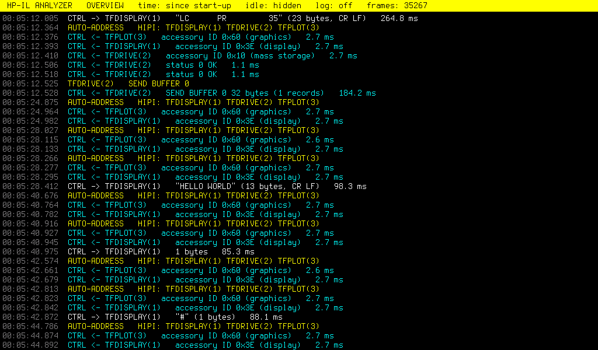</a>

**Overview** (the default) shows one line per event:

```
00:04:05.016  CTRL -> TFDISPLAY(1)   "HELLO WORLD" (13 bytes, CR LF)   26.0 ms
00:04:05.090  CTRL <- TFDRIVE(2)   status 23 NEW TAPE   2.0 ms
00:04:05.102  NO RESPONSE: SST to addr 3
00:04:05.118  TFDRIVE(2)   SEEK track 0 record 5
00:04:05.830  CTRL <- TFDRIVE(2)   READ 512 bytes (2 records)   41.0 ms
```

- **White and cyan:** data sent to and from devices, summarised. Text is shown
  as text, anything else as a number of bytes.
- **Yellow:** events such as auto-addressing, clearing the loop, the cassette
  drive's commands.
- **Red:** problems: no answer, transmission errors, slow answers (over half
  a second).
- Devices outside HIPI are shown by address, and by their type once they
  have told it (e.g. `addr 4 (printer)`). Devices in a PC program connected
  through PILBOX (e.g. pyILPER) are marked **PC**, e.g. `PC addr 4 (printer)`.
- The loop's controller — usually the HP-41 — is shown as **CTRL**, since HP-IL
  messages don't say who sent them.

**Detailed** shows every single message on the loop, explained.

Press **OK** in the analyzer for its menu:

| Menu item | Does |
|-----------|------|
| **Clear** | Empties the analyzer |
| **Mode** | Overview or Detailed — switching shows the recorded history again in the new mode |
| **Time** | Time since start-up, or time since the previous line |
| **Idle frames** | Hide or show the loop's idle polling |
| **Logging >** | **Start** / **Stop**: write everything from now on to a new file, `logs/analyzer_<n>.txt`. **Save**: when not logging, save what the analyzer holds right now to a new file — handy when something just happened. (Not while connected to a PC.) |
| **Leave view** | Back to the view you came from |

---

### 11.1 The loop map

**More → Go to view → Loop map** draws the HP-IL loop as a ring: the controller (usually
the HP-41) on the left, and every device in loop order around it with its
address, name, device ID and type. Yellow cards are HIPI's own devices, blue
ones the devices of a PC program connected through PILBOX (e.g. pyILPER),
orange ones other devices on the loop. The cards get smaller when there are
many devices, so up to 30 fit.

**Touch a card** to see everything known about that device — where it is,
its address, device ID and type, its status, when it was last used and how
much it has sent and received. Touch again to close the box. **X** leaves the
map.

<a href="images/loopmap.png">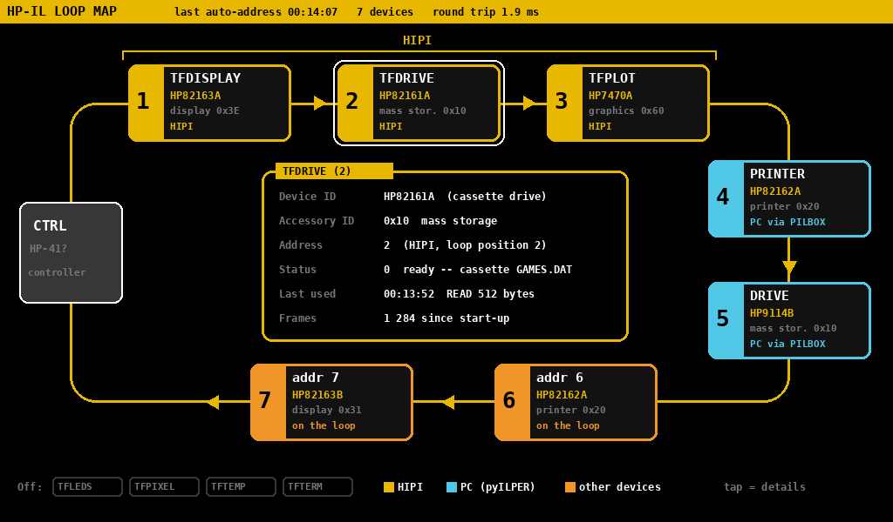</a>

HIPI only listens, so the map fills in as the loop is used: the addresses
come from the controller's auto-addressing, a device's type and ID once the
controller has asked for them (until then the card shows `?`), and devices that
sit after HIPI on the loop appear the first time the controller talks to them.

---

### 11.2 HP-IL signals (troubleshooting)

If the controller can't reach HIPI (TRANSMIT ERR) or if you experience other errors
you could check the signal, **More → Go to view → HP-IL signals** shows what actually arrives on HIPI's HP-IL
input, drawn like in the HP-IL specification: the first frame of a capture as
one line — up for a positive pulse, down for a negative one — with each
bit's value above it (the first one marked **sync**), the field names below
(C2 C1 C0 = control, D7…D0 = data), a time scale, and the frame it gives
(e.g. **SDA**, frame 0x560, ready). Below that: pulse widths, the frame's
length, and the whole capture (about 4 ms) small, with the name of every
frame found in it. If the receiver can't make a frame of what arrived, the
view says after how many bits it gave up.

A new capture every half second while traffic comes in. **X** leaves.

**Bit cells** in the view's menu (OK) chooses how the bits are told apart:

- **Bands** (the default) — a dark grey band behind every other bit.
- **Lines** — a thin line between the bits.
- **None** — nothing; the background is black all over.

<a href="images/signal-overview.png">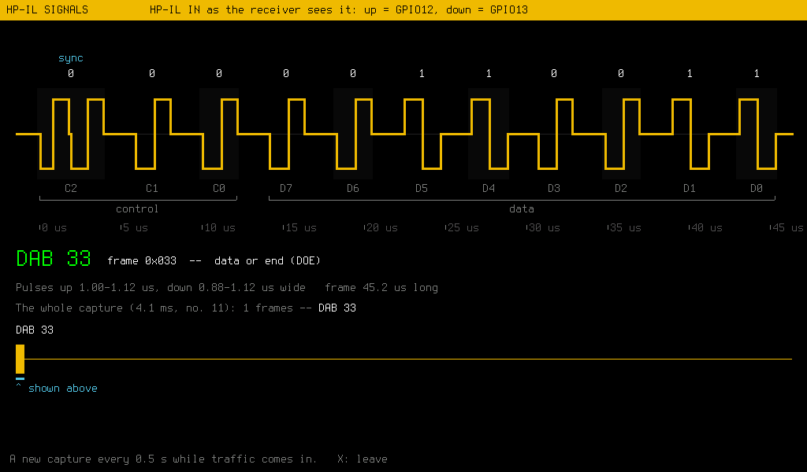</a>

---

## 12. The settings file, CONFIG.TXT

HIPI keeps its settings in `CONFIG.TXT` in the root of the SD card. It
creates the file itself at the first start and writes it again whenever a
setting is changed in the menus — so normally you never need to touch it.
But it is a plain text file, and it can be edited on a computer: take the SD
card out, or connect HIPI with USB (**System → Connect to PC**) and open it
on the SD card drive. The new settings are used at the next start.

**The format:** one setting per line, `name=value`. Spaces around the name
and the value are allowed; lines starting with `#` are ignored, and so are
names HIPI doesn't know. Settings missing from the file get their default
value.

> **Good to know:** as HIPI writes the whole file again when you change a
> setting in a menu, your own comments and the order of the lines are not
> kept — only the settings themselves.

### The settings

**Cassettes**

| Setting | Values | Default | What it is |
|---------|--------|---------|------------|
| `media.<drive>` | a file name | — | The cassette in a drive: a LIF file in the `lif/` folder, e.g. `media.TFDRIVE=GAMES.DAT`. One line per drive. Empty = no cassette. (`filename=` from older versions still works for `TFDRIVE`.) |
| `drive_standby` | `0` / `1` | `0` | The cassette drive's power switch at start: `0` = ON, `1` = STANDBY. OFF is the drive in `disabled_devices`. (**Settings → Devices → Drive at start** sets both.) |

**Screen**

| Setting | Values | Default | What it is |
|---------|--------|---------|------------|
| `textcolor` | `0`–`65535` | `65535` | Text colour of the display view, as an RGB565 number. The menu's colours: `65535` white, `65504` yellow, `2016` green, `2047` cyan, `63488` red — any other RGB565 value works too. |
| `fontsize` | `0`–`3` | `0` | Text size of the display view (**Settings → Screen → Font size**). |
| `columns` | `0`, `1`–`100` | `0` | Characters per line; `0` = as many as fit. (The menu offers 25, 32 — the HP 82163's own — 33, 50 and 100.) |
| `brightness` | `0`–`255` | `255` | Backlight. The menu's steps: `51`, `102`, `153`, `204`, `255` (20–100 %). |
| `plot_fit` | `1` / `0` | `1` | Plotter view: `1` = Fit (the drawing fills the screen), `0` = Page (like the paper). |
| `plot_paper` | `white` / `black` | `white` | Plotter paper: `white` = dark pens on white, `black` = inverted, light pens on black. |
| `signal_cells` | `bands` / `lines` / `none` | `bands` | HP-IL signals view: how the bits are marked — shaded bands behind every other bit, thin lines between them, or nothing. |
| `display_mirror` | `on` / `off` | `off` | 7" panel: send the screen to **hipiview** on a PC (**Settings → Screen → Mirror to PC**). See [Recording the screen on a PC](#recording-the-screen-on-a-pc-7-panel). |

**Screen saver** (see [4.3](#43-screen-saver-and-clock))

| Setting | Values | Default | What it is |
|---------|--------|---------|------------|
| `saver` | `0`–`5` | `0` | What happens after 10 minutes without use: `0` Dim, `1` Clock, `2` Off, `3` HP-IL rain, `4` Goose, `5` Random (rain or goose). |
| `clock_fallback` | `0`, `3`, `4`, `5` | `3` | What Clock mode shows without a usable clock chip: `0` Dim, `3` HP-IL rain, `4` Goose, `5` Random. |
| `clock_style` | `0` / `1` | `0` | `0` Dark (light on black), `1` LCD (dark on light). |
| `clock_us` | `0` / `1` | `0` | Date format: `0` EU `2026-10-03`, `1` US `10/03/2026`. |
| `clock_12h` | `0` / `1` | `0` | Time: `0` 24 h, `1` 12 h with AM/PM. |

**Devices and the loop**

| Setting | Values | Default | What it is |
|---------|--------|---------|------------|
| `disabled_devices` | device names, comma-separated | (empty) | Devices switched off — not on the HP-IL loop (**Settings → Devices → Enable/disable**). |
| `device_order` | device names, comma-separated | (empty = the standard order) | The devices' order on the loop (**Settings → Devices → Change order**). Devices not in the list come after the listed ones; unknown names are ignored. |
| `con_loop` | `cable` / `internal` | `cable` | PILBox CON mode: the loop through the HP-IL cable, or closed inside HIPI (**Settings → PC link → CON loop**). |

The device names: `TFDISPLAY`, `TFDRIVE`, `TFLEDS`, `TFPIXEL`, `TFTEMP`,
`PILBOX`, `TFPLOT`, `TFTERM` — in capitals, and no spaces in the lists.

**Logging and screen dumps**

| Setting | Values | Default | What it is |
|---------|--------|---------|------------|
| `trace` | `0` / `1` | `0` | Log every HP-IL frame on the USB debug port (**Settings → PC link → Trace: On**). |
| `debug` | `0` / `1` | `0` | Extended trace: more detail, e.g. the PC link (**Trace: Extended** sets both). |
| `screendump_next` | a number | `0` | The number the next screen dump gets: `screenshots/screendump_<n>.bmp`. |

### An example

A HIPI with the text in green and a little larger, 32 characters per line
like the original video interface, the backlight at 80 %, the plotter on
black paper, the clock as
screen saver in LCD style with US date and 12-hour time (the geese if the
clock chip is missing), a cassette, the LEDs and the terminal switched off,
and PILBOX first on the loop:

```
# My HIPI
media.TFDRIVE=GAMES.DAT
drive_standby=0
textcolor=2016
fontsize=1
columns=32
brightness=204
plot_fit=1
plot_paper=black
saver=1
clock_fallback=4
clock_style=1
clock_us=1
clock_12h=1
disabled_devices=TFLEDS,TFTERM
device_order=PILBOX,TFDISPLAY,TFDRIVE,TFPIXEL,TFTEMP,TFPLOT,TFLEDS,TFTERM
con_loop=cable
trace=0
debug=0
screendump_next=12
```

---

## 13. Updating the software

A new version comes as a `.uf2` file, `hipi_7_pico.uf2`, in the HIPI download.

1. Connect HIPI to your computer with USB.
2. Choose **More → System → Bootsel mode**. The screen goes dark, and a drive called
   **RP2350** appears on the computer.
3. Copy the `.uf2` file onto that drive.
4. HIPI restarts with the new version — the version number is shown at start-up.

<a href="images/update-rp2350-drive.png">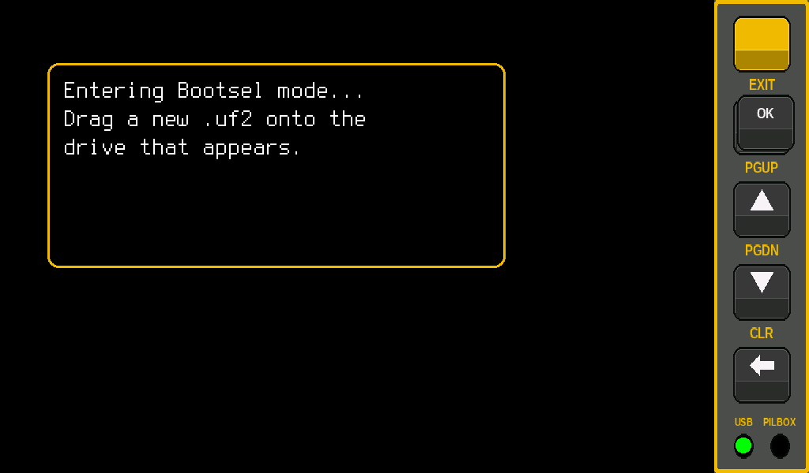</a>

**If HIPI doesn't start at all:** hold the small **BOOTSEL** button on the Pico
board inside while you plug in the USB cable, then do step 3.

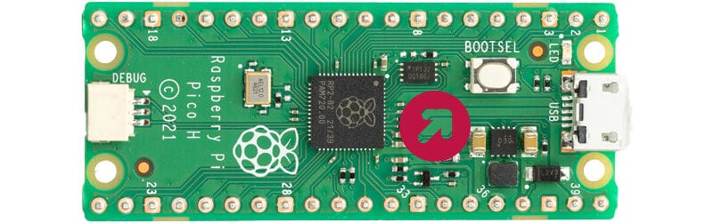

Your settings and files on the SD card are kept. If a new version needs new SD
card files, they are in the SD card zip of that download.

---

## 14. Troubleshooting

| Problem | Try this |
|---------|----------|
| HP-41 can't find the drive or the cassette | Is a cassette chosen (not *No media*)? Is `TFDRIVE` ON in **Devices**, and the switch in the Tape view not OFF? |
| Nothing shows on the screen | Is `TFDISPLAY` ON in **Devices**? Is the Display view chosen (swipe)? |
| Tape view is missing | The tape pictures are missing from the `resources` folder — copy the files from the SD card zip |
| Files copied from the PC don't show | Eject the drive on the computer first |
| Screen dump fails | Not possible while **Connect to PC** is on |

Still stuck? Choose **Settings → PC link → Trace: On** and connect HIPI to a computer: the
log helps whoever looks at the problem.

---

## 15. Words you may meet

- **HP-IL** — HP's cable system that connects the controller to its peripherals.
- **Loop** — HP-IL devices are connected in a ring, from OUT to IN, back to the
  calculator.
- **Address** — the number the controller uses to reach each device. It hands them
  out by itself.
- **LIF** — the file system used on HP cassettes; `.dat` files contain it.
- **SD card** — the small memory card holding HIPI's cassettes, pictures and
  settings.
- **UF2 file** — a software update for HIPI.
