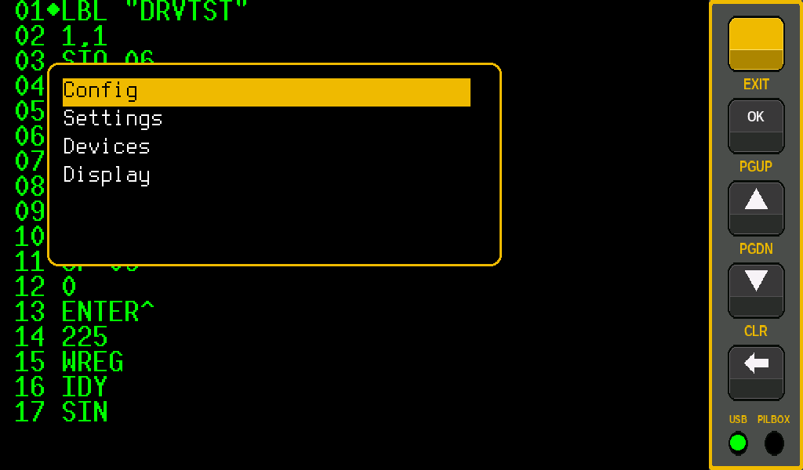

# HIPI Board — User Manual

**HP-IL Pico Interface for the HP-41**

<!-- TODO image: replace the placeholder below with:
 -->
> 📷 **Image placeholder:** HIPI and an HP-41 connected and running (`images/hero-hipi-with-hp41.jpg`)

---

## Contents

1. [What is HIPI?](#1-what-is-hipi)
2. [What you need](#2-what-you-need)
3. [Getting started](#3-getting-started)
4. [Using the touch screen](#4-using-the-touch-screen)
5. [The three views](#5-the-three-views)
6. [The menus](#6-the-menus)
7. [Cassette files](#7-cassette-files)
8. [HIPI's other devices](#8-hipis-other-devices)
9. [Connecting to a PC](#9-connecting-to-a-pc)
10. [Screen dumps](#10-screen-dumps)
11. [Updating the software](#11-updating-the-software)
12. [Troubleshooting](#12-troubleshooting)
13. [Words you may meet](#13-words-you-may-meet)

---

## 1. What is HIPI?

HIPI is a small box with a touch screen that connects to your HP-41 through the
HP-IL module. To the HP-41 it looks like a whole set of classic HP peripherals
at once:

| HIPI acts as…                 | Original HP device        | Shows up as |
|-------------------------------|---------------------------|-------------|
| Video display                 | HP 82163 Video Interface  | `TFDISPLAY` |
| Cassette drive                | HP 82161A Digital Cassette Drive | `TFDRIVE` |
| Plotter                       | HP 7470A                  | `TFPLOT`    |
| Temperature/pressure sensor   | —                         | `TFTEMP`    |
| LEDs and colour pixels        | —                         | `TFLEDS`, `TFPIXEL` |
| Link to a PC emulator         | PILBox                    | `PILBOX`    |
| Terminal over USB             | —                         | `TFTERM`    |

Cassettes are simply files on a micro-SD card, so you never run out of tape.

<!-- TODO image: replace the placeholder below with:
 -->
> 📷 **Image placeholder:** The finished HIPI unit, front view (`images/hipi-unit-front.jpg`)

<!-- TODO image: replace the placeholder below with:
 -->
> 📷 **Image placeholder:** The connectors — HP-IL IN/OUT, USB, SD card slot (`images/hipi-unit-connectors.jpg`)

---

## 2. What you need

- An **HP-41** (C, CV or CX) with an **HP 82160A HP-IL module**
- The **HIPI unit**
- **HP-IL cables** — two, to make the loop with the HP-41
- A **micro-SD card** (FAT32 recommended)
- A **USB cable** and a USB power supply (or a computer)

---

## 3. Getting started

### 3.1 Prepare the SD card

The HIPI download contains two things: the software (a `.uf2` file, see
[chapter 11](#11-updating-the-software)) and a **zip file with everything the SD
card needs**.

1. Unzip the SD card zip.
2. Copy its contents to the SD card, keeping the folders.
3. Put your own cassettes (`.dat` files) in the `lif` folder — see
   [chapter 7](#7-cassette-files).

The SD card then looks like this:

```
CONFIG.TXT        HIPI's settings (created by HIPI itself)
resources/        the cassette drive's pictures: hp82161a.bmp,
                  tape-in.bmp, open.bmp, leds.bmp, reels.bmp
lif/              your cassettes (.dat files)
screenshots/      screen dumps (created by HIPI when you save the first)
```

HIPI creates its settings file, `CONFIG.TXT`, by itself. The buttons, menus and start-up screen are built in, so HIPI can be used without an SD card too — just without cassettes, pictures and saved settings.

### 3.2 Connect everything

1. Turn the HP-41 **off**.
2. Connect the HP-41's HP-IL **OUT** to HIPI's **IN**, and HIPI's **OUT** back
   to the HP-41's **IN**. HP-IL always forms a closed loop.
3. Insert the SD card.
4. Connect USB power. HIPI starts.
5. Turn the HP-41 on.


### 3.3 First start

HIPI shows its start-up screen: the version, and a **STATUS** list that fills
in line by line as HIPI starts — SD card, settings, USB, the HP-IL loop, the
tape pictures, each cassette drive's file and the trace setting. A green dot
means OK, red means something is missing, grey means off. On the right, the
**DEVICES ON THE LOOP** are shown in loop order: yellow when switched on,
grey when off.

After a few seconds (or when you touch the screen) HIPI is ready. Anything
the HP-41 prints now appears on the screen.


---

## 4. Using the touch screen

### 4.1 The button strip

The buttons are hidden to give the text more room. **Touch the right edge of the
screen** to slide them in. They slide away again after 5 seconds without use.


| Button | Does | With **Shift** first |
|--------|------|----------------------|
| **OK** | Opens the menu / chooses | EXIT — closes the menu |
| **▲**  | Scrolls text back one line / moves up | One page |
| **▼**  | Scrolls forward one line / moves down | One page |
| **X**  | Back to the live text / back one menu level | CLR — clears the screen |

**Shift** is the yellow button at the top: tap it, then tap the other button.

### 4.2 Corners and swipes

| Touch | What happens |
|-------|--------------|
| **Top-left corner** | Info box: current file, settings, version |
| **Bottom-left corner** | List of HIPI's HP-IL devices and their addresses. Swipe up/down to scroll |
| **Swipe left or right** | Switch view. Each device with a view (display, plotter, cassette drive) has its own, in the order the devices are on the loop: swipe left for the next, right for the previous |


When you switch view, a yellow box shows the name of the new view for a moment.
Touches are ignored while it's showing.


---

## 5. The three views

### 5.1 Display

The HP 82163 video display: everything the HP-41 prints, like `PRA`, `PRX` or
program listings. Scroll back with ▲ and ▼.


### 5.2 Plotter

Shows what the HP-41 draws on the plotter (`TFPLOT`). The drawing keeps growing
while you look at other views. Clear it with **Display → Clear plotter**.


### 5.3 Tape

A picture of the HP 82161A cassette drive — and you can use it like the real
thing.


| On the picture | What it does |
|----------------|--------------|
| **Cassette window** | Shows the cassette with the file name on its label. Touch it to pick another file |
| **OPEN** button | Opens the lid and the file list |
| **REWIND** button | Rewinds the tape (takes a few seconds; not while BUSY is lit) |
| **OFF–STANDBY–ON** switch | Touch to move it one step. OFF takes the drive off the loop; ON keeps it on; in STANDBY the HP-41 can switch it off and on to save power |
| **POWER** light | The drive is on |
| **BUSY** light | The drive is working, or the HP-41 is talking to it |
| **Reels** | Spin while the tape is read, written or wound |


---

## 6. The menus

Press **OK** to open the menu. **▲/▼** to move, **OK** to choose, **X** to go
back. **Shift + OK** closes the menu from anywhere.



```
Main menu
├── Config
│   ├── Select file        Choose the cassette (.dat file)
│   ├── Trace              Log HP-IL traffic (for troubleshooting)
│   ├── Connect to PC      Show the SD card on your computer
│   ├── Loopback test      Test the HP-IL connection
│   ├── Scan I2C           List connected I2C sensors
│   └── Bootsel mode       Get ready for a software update
├── Settings
│   ├── Textcolor          White, yellow, green, cyan or red
│   ├── Font size          0 – 3
│   ├── Brightness         20 – 100 %
│   └── Columns            Characters per line
├── Devices
│   ├── Enable/disable     Turn HIPI's devices on or off
│   └── Change order       Change the devices' order on the loop
└── Display
    ├── Display, Plotter, Tape…    Choose a view (one row per device)
    ├── Clear plotter
    ├── Clear screen
    └── Screendump         Save the screen as a picture
```

All settings are remembered, also after power off.

### A few worth knowing

- **Devices → Enable/disable** — each of HIPI's devices can be switched off. A switched-off device
  is gone from the loop, just as if it were unplugged. Handy if you have the
  real HP device connected too.
- **Devices → Change order** — sets the order of HIPI's devices on the loop,
  which also decides their addresses. Pick a device with ▲/▼ and **OK**, move
  it with ▲/▼, and press **OK** to keep the new place (or **X** to put it back).
  The order is remembered; the HP-41 hands out the new addresses the next time
  it sets up the loop.
- **Columns** — *Auto* fits the font size; *32* is the original HP 82163 width.
- **Loopback test** — connect HIPI's IN and OUT with one HP-IL cable (no HP-41),
  then run it. "Loopback OK!" means the HP-IL side works.


---

## 7. Cassette files

Each `.dat` file on the SD card is one cassette.

### Adding cassettes

Copy your `.dat` files to the `lif` folder on the SD card — either with a
card reader, or straight from HIPI with **Connect to PC** (see
[chapter 9](#9-connecting-to-a-pc)).

### Choosing a cassette

Use **Config → Select file**, or touch the cassette window in the Tape view.


- **No media** at the top means *no cassette in the drive*.
- After choosing a file you get three options:
  **OK** — use it, **X** — back to the list, **▼** — show what's on it.
- While the file list is open the drive has no cassette in it, just like a real
  drive with the lid open.

### What's on the cassette?

Press **▼** to see the cassette's contents: its name, size, free space and the
list of files with type and size (in registers, like the HP-41's `DIR`).
Scroll with ▲/▼ (Shift for a page), **OK** to use the cassette, **X** to go back.


---

## 8. HIPI's other devices

Besides the display and the cassette drive, HIPI has a few more devices you can
use from HP-41 programs. You talk to them like any HP-IL device: **select** it
with its address, then send text with `OUTA` or read with `INA`.

**Finding the address:** touch the **bottom-left corner** of the screen. The list
shows each device's address — use that number with `SELECT`. The examples below
use the address 3; replace it with the one shown on your screen.

### 8.1 Plotter — `TFPLOT`

An HP 7470A pen plotter; the drawing appears in the Plotter view. It works with
HP-41 plotter software, and you can also send plotter commands (HP-GL) yourself:

```
01 LBL "BOX"
02 3
03 SELECT
04 "IN SP1"
05 "⊢ PU1000 1000"
06 OUTA
07 "PD4000 1000"
08 "⊢ 4000 4000"
09 OUTA
10 "PD1000 4000"
11 "⊢ 1000 1000"
12 OUTA
13 "PU"
14 OUTA
15 END
```

This draws a square. Swipe to the Plotter view to see it.

Two things make plotter commands easy to type on the HP-41:

- **No `;` needed.** A new command letter, or the end of the text, ends a
  command, and numbers can be separated with spaces instead of commas —
  `PD4000 1000` means the same as `PD4000,1000;`.
- **Long commands are split** over two program lines, since one text line holds
  at most 15 characters. `⊢` is **APPEND** (in ALPHA mode: shift + K), which
  adds the text to what's already in ALPHA.


### 8.2 Temperature and pressure — `TFTEMP`

Reads a temperature/pressure sensor connected to HIPI. Tell it what to measure,
then read the value:

| Send | Means |
|------|-------|
| `MT` | Measure temperature (°C) |
| `MP` | Measure pressure (hPa) |
| `P1` | Show 1 decimal (`P0`–`P9`) |

```
01 LBL "TEMP"
02 3
03 SELECT
04 "MT"
05 OUTA
06 INA
07 AVIEW
08 END
```

Each `INA` takes a fresh reading, for example `21.4`.

### 8.3 LEDs — `TFLEDS`

Controls the LEDs on the HIPI board. A command is the LED number(s) followed by
what to do; several commands can be separated by spaces.

| Send | Means |
|------|-------|
| `1O` | LED 1 on (`0` = all LEDs, `135` = LEDs 1, 3 and 5) |
| `1C` | LED 1 off |
| `2B5` | LED 2 blinks 5 times (`B` alone = forever) |
| `3B10:100:400` | LED 3 blinks 10 times, 100 ms on, 400 ms off |
| `0S50` | Brightness 50 % |
| `2F+800` | LED 2 fades on over 0.8 s (`F-` fades off) |

```
01 LBL "BLINK"
02 3
03 SELECT
04 "1B0:100:900"
05 OUTA
06 END
```

LED 1 now flashes briefly once a second, until you send `1C`.

<!-- TODO image: replace the placeholder below with:
 -->
> 📷 **Image placeholder:** HIPI with its LEDs lit (`images/example-leds.jpg`)

### 8.4 Colour pixels — `TFPIXEL`

Controls a strip of colour LEDs (NeoPixels) connected to HIPI. Pixels are chosen
like the LEDs: a number, `0` for all, or a range like `3-10`.

| Send | Means |
|------|-------|
| `0O` | All pixels on |
| `0C` | All pixels off |
| `0S30` | Brightness 30 % for the whole strip |
| `5X` + one colour byte | Pixel 5 gets a colour |

The colour byte is built as *red* (0–7) × 32 + *green* (0–7) × 4 + *blue* (0–3),
and added to the text with `XTOA` (HP-41CX, or the X-Functions module).
Full red is 7 × 32 = 224:

```
01 LBL "RED"
02 3
03 SELECT
04 "0X"
05 224
06 XTOA
07 OUTA
08 END
```

A few colours: red 224, green 28, blue 3, yellow 252, white 255.

<!-- TODO image: replace the placeholder below with:
 -->
> 📷 **Image placeholder:** A pixel strip lit up by HIPI (`images/example-pixels.jpg`)

### 8.5 Terminal — `TFTERM`

Makes a terminal program on your computer act as a display and keyboard on the
HP-IL loop — made for the HP-71B's `DISPLAY IS` and `KEYBOARD IS`. From the
HP-41, text sent to `TFTERM` with `OUTA` appears in the terminal program.

HIPI shows up on the computer as a few serial ports; the terminal is the
**third** one (on Linux usually `/dev/ttyACM2`). Open it in any terminal
program, for example PuTTY on Windows or `minicom` on Linux.

<!-- TODO image: replace the placeholder below with:
 -->
> 📷 **Image placeholder:** A terminal program on the PC showing text from the calculator (`images/example-terminal.png`)

### 8.6 PC link — `PILBOX`

Lets an HP-IL emulator on your computer, such as **pyILPER**, join the loop.
The emulator's virtual drives and printers then work with the HP-41 as if they
were connected with cables. In the emulator, choose the **second** serial port
HIPI creates (on Linux usually `/dev/ttyACM1`) as its PILBox port.

When no emulator is running, `PILBOX` simply passes everything on.

<!-- TODO image: replace the placeholder below with:
 -->
> 📷 **Image placeholder:** pyILPER connected to HIPI's PILBox port (`images/example-pyilper.png`)

---

## 9. Connecting to a PC

To copy cassette files or screen dumps, you can reach the SD card from your
computer without taking it out:

1. Connect HIPI to the computer with USB.
2. Choose **Config → Connect to PC**. The SD card appears on the computer as a
   USB drive.
3. Copy your files.
4. **Eject** the drive on the computer. HIPI notices and goes back to normal
   by itself. (Or choose **Disconnect from PC** in the menu.)

While connected, the cassette drive is paused and screen dumps are not possible.

<!-- TODO image: replace the placeholder below with:
 -->
> 📷 **Image placeholder:** The SD card shown as a drive on the computer (`images/pc-usb-drive.png`)

<!-- TODO image: replace the placeholder below with:
 -->
> 📷 **Image placeholder:** "Disconnect from PC" in the Config menu (`images/menu-connect-pc.png`)

---

## 10. Screen dumps

**Display → Screendump** saves the screen as a picture in the `screenshots`
folder on the SD card: `screendump_0.bmp`, `screendump_1.bmp` and so on. It takes a few seconds; a
yellow box tells you when it's done. The menu itself is not in the picture.

You can also take one from an HP-41 program (with the display device selected):

| Keys | Saves |
|------|-------|
| `27 ACCHR  35 ACCHR  68 ACCHR` | Just the screen |
| `27 ACCHR  35 ACCHR  77 ACCHR` | The screen **with** menus and buttons, exactly as you see it |

---

## 11. Updating the software

A new version comes as a `.uf2` file, `hipi_7_pico.uf2`, in the HIPI download.

1. Connect HIPI to your computer with USB.
2. Choose **Config → Bootsel mode**. The screen goes dark, and a drive called
   **RP2350** appears on the computer.
3. Copy the `.uf2` file onto that drive.
4. HIPI restarts with the new version — the version number is shown at start-up.

<!-- TODO image: replace the placeholder below with:
 -->
> 📷 **Image placeholder:** The RP2350 drive on the computer, with the .uf2 file being copied (`images/update-rp2350-drive.png`)

**If HIPI doesn't start at all:** hold the small **BOOTSEL** button on the Pico
board inside while you plug in the USB cable, then do step 3.

<!-- TODO image: replace the placeholder below with:
 -->
> 📷 **Image placeholder:** Where the BOOTSEL button is (`images/update-bootsel-button.jpg`)

Your settings and files on the SD card are kept. If a new version needs new SD
card files, they are in the SD card zip of that download.

---

## 12. Troubleshooting

| Problem | Try this |
|---------|----------|
| HP-41 can't find the drive or the cassette | Is a cassette chosen (not *No media*)? Is `TFDRIVE` ON in **Devices**, and the switch in the Tape view not OFF? |
| Nothing shows on the screen | Is `TFDISPLAY` ON in **Devices**? Is the Display view chosen (swipe)? |
| Tape view is missing | The tape pictures are missing from the `resources` folder — copy the files from the SD card zip |
| Files copied from the PC don't show | Eject the drive on the computer first |
| Screen dump fails | Not possible while **Connect to PC** is on |

Still stuck? Choose **Config → Trace → On** and connect HIPI to a computer: the
log helps whoever looks at the problem.

---

## 13. Words you may meet

- **HP-IL** — HP's cable system that connects the HP-41 to its peripherals.
- **Loop** — HP-IL devices are connected in a ring, from OUT to IN, back to the
  calculator.
- **Address** — the number the HP-41 uses to reach each device. It hands them
  out by itself.
- **LIF** — the file system used on HP cassettes; `.dat` files contain it.
- **SD card** — the small memory card holding HIPI's cassettes, pictures and
  settings.
- **UF2 file** — a software update for HIPI.
