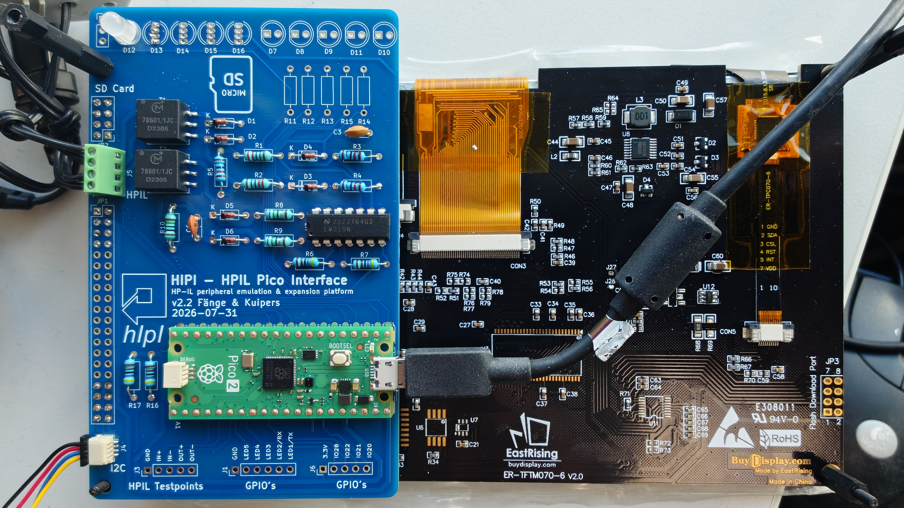

# HIPI Board — Hardware

This document describes the HIPI circuit board: which parts to order, how to
assemble it, and how to test it. For firmware, building and flashing, see the
main [README](../README.md) and the
[User & Developer Guide](../documents/GUIDE.md).

> [!NOTE]
> On the board in this picture, the NeoPixel **D12 is mounted on the wrong
> side** — it should be on the back of the PCB (see
> [NeoPixels and LEDs](#4-neopixels-and-leds)). No ordinary LEDs (D7–D11)
> are fitted on this device.

<!-- TODO image: replace the placeholder below with:
 -->
> 📷 **Image placeholder:** The assembled HIPI board, back side with LEDs/NeoPixels (`images/hipi-board-back.jpg`)

**Contents**

1. [Bill of materials](#1-bill-of-materials)
2. [Selecting a display](#2-selecting-a-display)
3. [Assembly](#3-assembly)
4. [NeoPixels and LEDs](#4-neopixels-and-leds)
5. [Connectors](#5-connectors)
6. [Testing the board](#6-testing-the-board)

---

## 1. Bill of materials

The complete parts list is in **[HIPI-BOM.xlsx](HIPI-BOM.xlsx)**. Note that some part are optional (like the LED's).

### Choosing a Pico

- Almost any pin-compatible **Raspberry Pi Pico 2** board can be used. All
  development has been done on a Pico 2.
- An original Pico (RP2040) will probably work as well, but has not been
  tested.
- A **Pico 2 W** could be used to add Wi-Fi and/or Bluetooth, but this has not
  been tested yet.
- The official Pico board has a Micro-USB connector. Some third-party boards
  use USB-C instead, if you prefer that.

---

## 2. Selecting a display

The board is designed to mount directly on this 7" display panel (SPI
interface, capacitive touch over I2C):

<https://www.buydisplay.com/spi-7-inch-tft-lcd-dislay-module-1024x600-ra8876-optl-touch-screen-panel>

With this panel the HIPI board is plug-and-play. In theory any SPI display
could be used, but the firmware would have to be adapted and the board
mounted in some other way.

### Ordering options

Select the following options when ordering:

| Option                 | Select                                   |
|------------------------|------------------------------------------|
| Interface              | Pin Header Connection – 4-Wire SPI       |
| Power Supply (Typ.)    | VDD = 5.0 V                              |
| Touch Panel            | 7" Capacitive Touch with Controller      |
| MicroSD Card Interface | Pin Header Connection                    |
| Font Chip              | None (not used by the firmware)          |

### Backlight modification

> [!IMPORTANT]
> The display panel needs one modification before use. **The firmware is
> written for option 1.**

**Option 1 — backlight controlled by the panel (recommended)**

On the display panel, remove the solder from jumper **J27** and add a solder
bridge on **J28**. The backlight is then driven by the display controller, and
the firmware sets the brightness through it (**Settings → Brightness**). No
extra wiring is needed.

<!-- TODO image: replace the placeholder below with:
 -->
> 📷 **Image placeholder:** Jumpers J27 and J28 on the display panel, after the modification (`images/display-j27-j28.jpg`)

**Option 2 — backlight wired to the HIPI board**

Leave the jumpers on the panel as delivered and add a wire from the panel's
backlight pin to the HIPI board, either to:

- **5 V** — the backlight is always on at full brightness, and
  **Settings → Brightness** has no effect; or
- **a free GPIO on the Pico** — the backlight can be controlled by the Pico,
  but the firmware must first be changed to drive that GPIO instead of the
  display controller's backlight output.

---

## 3. Assembly

The board is designed to be easy to assemble for anyone with basic soldering
skills.

- Mount the Pico in **female headers** and use a Pico with pre-soldered pin
  headers. This way the Pico can be removed or replaced later.

<!-- TODO image: replace the placeholder below with:
 -->
> 📷 **Image placeholder:** The Pico mounted in female headers (`images/pico-female-headers.jpg`)
- Decide on the LED options (next section) **before** soldering, since some
  choices exclude others.

---

## 4. NeoPixels and LEDs

The board can be fitted with NeoPixels (WS2812) or ordinary LEDs, either as
status indicators or for effects controlled by the HP-IL controller.

> [!WARNING]
> **Mount the NeoPixels and LEDs on the back of the PCB** (the side facing
> the display panel). Otherwise they will point away from the user.

<!-- TODO image: replace the placeholder below with:
 -->
> 📷 **Image placeholder:** LED and NeoPixel positions D7–D16 on the back of the PCB (`images/led-positions.jpg`)

### Options

**NeoPixels on the board (D12–D16)**

- Up to 5 NeoPixels can be mounted directly on the board.
- They must be fitted in order from D12 upwards: if only one is used, it
  must be in D12; two go in D12 and D13, and so on.

**NeoPixel bar or strip**

- A small 3-pin connector is provided for an external NeoPixel bar or strip.
- Only short bars are supported, since there is no separate power supply for
  the bar.
- If both a bar and on-board NeoPixels are used, the first pixel on the bar
  always mirrors the ones on the board.

**Ordinary LEDs (D7–D11)**

- Up to 5 ordinary LEDs can be mounted, in any order and any number.
- Each LED needs its series resistor (R11–R15). If no LEDs are fitted, the
  resistors can be left out.

### Conflicts

| If you use…                  | …you cannot fit |
|------------------------------|-----------------|
| NeoPixels (board or bar)     | D7              |
| RX/TX out of the board (J1/J3/J6) | D10 and D11 |

---

## 5. Connectors

| Connector | Required | Purpose |
|-----------|----------|---------|
| JP1       | **Yes**  | Display and touch interface |
| JP2       | **Yes**  | SD-card interface on the display panel |
| JP5       | No       | HP-IL wires. A screw terminal is suggested, but any connection method works. |
| J1, J3, J6| No       | Measurement points, RX/TX, and extra GPIOs for external devices |
| J4        | No       | Qwiic connector for external I2C devices |

<!-- TODO image: replace the placeholder below with:
 -->
> 📷 **Image placeholder:** Connector locations on the PCB (`images/connectors.jpg`)

**JP1 does not need all 40 pins.** Only two 2×4-pin headers, one at each end,
are used with the SPI display. The remaining pins are only needed for a
parallel display interface.

<!-- TODO image: replace the placeholder below with:
 -->
> 📷 **Image placeholder:** The two 2×4-pin headers fitted at each end of JP1 (`images/jp1-headers.jpg`)

---

## 6. Testing the board

1. Fit at least JP1 and JP2, mount the board on the display, and apply power.
2. With the correct firmware on the Pico, the splash screen appears followed
   by a short boot summary.
3. **Touch:** touch the right-hand edge of the screen to show the button
   strip, then press **OK** to open the menu.
4. **HP-IL:** connect the HP-IL cables to JP5 and connect the OUT cable
   directly to the IN cable, so the loop is closed through the board only.
   Then run **Config → Loopback test**. It checks that the HP-IL interface
   and the cables work.

   <!-- TODO image: replace the placeholder below with:
    -->
   > 📷 **Image placeholder:** HP-IL cables connected OUT to IN for the loopback test (`images/loopback-test.jpg`)

5. **I2C (optional):** if you have connected something to J4, run
   **Config → Scan I2C** to check that its address shows up.